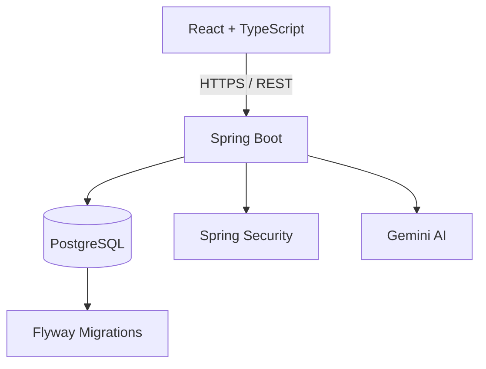
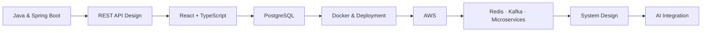

  

<h3 align="center">Java Developer • Spring Boot • React • REST APIs</h3>

Building backend and full-stack applications with Java and modern web technologies.

  

  
  
  
  

  📧 <code>ankit02098@gmail.com</code> &nbsp;(tap the badge above, or copy this address — <code>mailto:</code> links only open a compose window if your device has a default mail app configured)

  

---

## 👨‍💻 About Me

I'm a **Java Developer** and Computer Science graduate focused on building backend and full-stack applications using **Java, Spring Boot, React, and PostgreSQL**.

I enjoy designing REST APIs, implementing secure authentication and authorization, working with relational databases, and building complete applications from backend services to user-facing interfaces.

- 🎓 B.Tech in Computer Science
- ☕ Focused on Java and Spring Boot development
- 🌐 Building full-stack applications with React and TypeScript
- 🔐 Spring Security, JWT Authentication & RBAC
- 🗄️ PostgreSQL, MySQL, JPA & Hibernate
- 🐳 Docker-based development and deployment
- 🔌 REST API design and integration
- 🧠 Practicing Data Structures & Algorithms with Java
- ☁️ Exploring cloud deployment and distributed systems
- 🤖 Exploring practical AI integration in software applications
- 🎯 Open to **Java Developer**, **Java Backend Developer**, **Java Full Stack Developer** and **Software Engineer** opportunities

---

## 🛠️ Tech Stack

| Category | Stack |
|---|---|
| **Languages** |     |
| **Backend** |      |
| **Frontend** |     |
| **Databases** |   |
| **Tools & DevOps** |        |

---

## 🚀 Featured Projects

### 🏢 SocietyOS — Full-Stack Society Management Platform

SocietyOS is a full-stack platform designed to centralize everyday residential society operations and replace fragmented workflows such as spreadsheets, chat groups, and manual processes.

<b>✨ Key Features</b>

 

- 🔐 JWT authentication with access & refresh tokens
- 🛡️ Role-based authorization and society membership validation
- 🏢 Society, building, unit and resident management
- 👥 Resident onboarding and invitation workflows
- 🛠️ Complaint and maintenance management
- 📢 Announcements and notifications
- 📅 Meetings and events
- 💳 Maintenance dues and payment workflow
- 🤖 AI-assisted help using Gemini
- 🗄️ PostgreSQL with Flyway migrations
- ❤️ Spring Boot Actuator health monitoring
- 🌐 React + TypeScript frontend
- ☁️ Vercel + Render deployment

**Architecture**

**Tech Stack:** Java · Spring Boot · Spring Security · JWT · PostgreSQL · Flyway · React · TypeScript · Vite · REST APIs · Docker · Gemini · Vercel · Render

🔗 [Live Application](https://societyos-psi.vercel.app) &nbsp;|&nbsp; 🔗 [Repository](https://github.com/Ankit-code02/societyos)

---

### 🏥 MediSlot — Smart Healthcare Appointment Scheduling Platform

A Spring Boot-based healthcare appointment scheduling application designed to manage patients, doctors, appointments, authentication, and scheduling workflows.

<b>✨ Key Features</b>

 

- 🔐 JWT authentication
- 🛡️ Role-based access control
- 👨‍⚕️ Patient, Doctor and Admin roles
- 🔎 Doctor search by specialization
- 📅 Appointment booking and status tracking
- ⚠️ Appointment conflict detection
- 📧 Automated email reminders
- 🗄️ PostgreSQL persistence
- 🐳 Docker & Docker Compose

**Tech Stack:** Java · Spring Boot · Spring Security · JWT · PostgreSQL · JPA/Hibernate · Docker

🔗 [Repository](https://github.com/Ankit-code02/MediSlot)

---

### 🚗 Car Rental System — Full-Stack Car Rental Application

A full-stack web application built with React and Spring Boot for browsing, booking and managing rental cars.

<b>✨ Key Features</b>

 

- 🔐 Authentication
- 🚘 Car listing management
- 📅 Booking workflow
- 👨‍💼 Admin management
- 🔄 CRUD operations
- 📱 Responsive frontend

**Tech Stack:** Java · Spring Boot · React · TypeScript · REST APIs · Bootstrap

🔗 [Repository](https://github.com/Ankit-code02/Car-Rental-System)

---

### 🔐 SecureAuth API — Authentication & Authorization REST API

A Spring Boot backend focused on secure authentication, authorization and user management.

<b>✨ Key Features</b>

 

- 🔐 JWT authentication
- 🛡️ Spring Security
- 👥 Role-Based Access Control
- 🔌 REST APIs
- 🗄️ PostgreSQL
- 🧪 Postman API testing

**Tech Stack:** Java · Spring Boot · Spring Security · JWT · JPA/Hibernate · PostgreSQL

🔗 [Repository](https://github.com/Ankit-code02/SecureAuth-API)

---

### 🌐 Developer Portfolio

A responsive developer portfolio built with React, TypeScript, Vite and Framer Motion.

🔗 [Live](https://ankit-portfolio-two-brown.vercel.app) &nbsp;|&nbsp; 🔗 [Repository](https://github.com/Ankit-code02/ankit-portfolio)

---

## 📊 GitHub Statistics

> These cards are generated by GitHub Actions **inside this repo** and committed as static files — not fetched live from a shared third-party server — so they won't go down the way the old badges did. See the **Setup** note at the bottom of this README to switch them on.

  

  

---

## 🐍 Contribution Snake

  <picture>
    <source media="(prefers-color-scheme: dark)" srcset="https://raw.githubusercontent.com/Ankit-code02/Ankit-code02/output/github-contribution-grid-snake-dark.svg" />
    <source media="(prefers-color-scheme: light)" srcset="https://raw.githubusercontent.com/Ankit-code02/Ankit-code02/output/github-contribution-grid-snake.svg" />
    
  </picture>

---

## 🎯 Current Focus

- ☕ Strengthening Java & Spring Boot
- 🧠 Data Structures & Algorithms
- 🌐 Building full-stack applications
- 🗄️ Database design and SQL
- 🐳 Docker and deployment
- ☁️ AWS fundamentals
- 🔄 Microservices, Kafka and Redis
- 🏗️ System design fundamentals
- 🤖 AI integration in backend applications

---

## 🤝 Let's Connect

  
  
  

  <b>Building projects. Solving problems. Learning continuously.</b>

  

---

<b>⚙️ Setup — activate the metrics card and snake animation</b>

 

Both images above are generated by GitHub Actions that must run **inside your `Ankit-code02/Ankit-code02` profile repo** — they won't work just by editing this file. Two workflow files are provided alongside this README (`snake.yml` and `metrics.yml`).

1. In your profile repo, create the folder `.github/workflows/` and add both `snake.yml` and `metrics.yml` there.
2. Go to **Settings → Actions → General → Workflow permissions** and select **"Read and write permissions"** (required so the workflows can commit the generated SVGs back to your repo).
3. For the metrics card: create a [Personal Access Token](https://github.com/settings/tokens/new) with `repo` and `read:user` scopes, then add it as a repository secret named `METRICS_TOKEN` under **Settings → Secrets and variables → Actions**.
4. Go to the **Actions** tab, select each workflow, and click **"Run workflow"** once to generate the first version of each image.
5. After that, both workflows run on their own schedule and keep the images fresh automatically.

